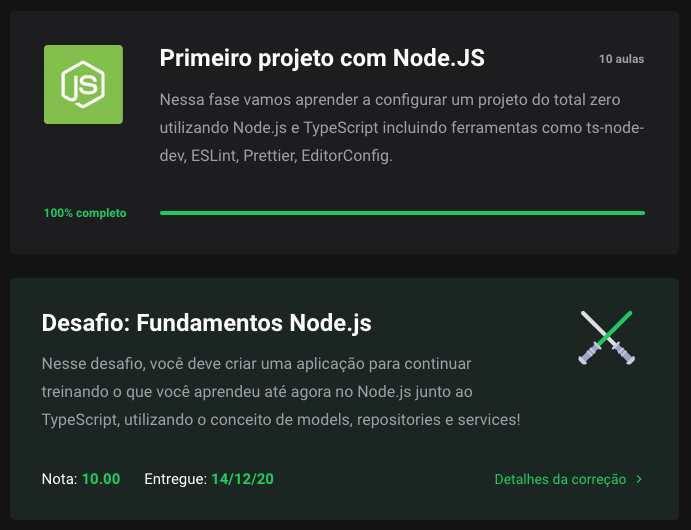

 <div align="center" id="top">
  <p align="center">
  	
  </p>
</div>

 <hr/>

<h1 align="center"> Fundamentos do NodeJS </h1>

<p align="center">
   
   
   
   
   
	
</p>	

<p align="center">
  <a href="#dart-sobre"> Sobre </a> &#xa0; | &#xa0; 
  <a href="#muscle-o-que-aprendi"> O que aprendi </a> &#xa0; | &#xa0; 
  <a href="#rocket-tecnologias"> Tecnologias </a> &#xa0; | &#xa0;
  <a href="#white_check_mark-requisitos"> Requisitos </a> &#xa0; | &#xa0;
  <a href="#checkered_flag-iniciando"> Iniciando </a> &#xa0; | &#xa0;
  <a href="#books-onde-aprender-mais"> Onde aprender mais </a> &#xa0; | &#xa0;
  <a href="#unlock-licença"> Licença </a> &#xa0; | &#xa0;
  <a href="https://www.linkedin.com/in/luiza-lissandra/" target="_blank"> Desenvolvedora </a>
</p>

<br>

## :dart: Sobre ##

<p align="center">
	
</p>

<br>

Este projeto é resultado do meu quarto desafio de código no <a href="https://rocketseat.com.br/gostack">bootcamp Go Stack da Rocketseat. </a> Nele fui desafiada a colocar em prática tudo que aprendi sobre os fundamentos do NodeJS com Typescript juntamente com models, repositories e services.

## :muscle: O que aprendi ##

Veja o que aprendi a partir dos conteúdos ensinados neste módulo somado às pesquisas complementares que fiz no <a href="https://www.notion.so/Fundamentos-do-NodeJS-4928c7f708bf46de81d93573ba969dc3">meu blog no Notion.</a> [:warning: Em construção] Neste artigo, falo sobre tudo que aprendi e trago recomendações gratuitas de onde você pode estudar sobre e ir para o próximo nível :blush: :rocket: 

## :rocket: Tecnologias ##

As seguintes tecnologias foram utilizadas nesse projeto:

- [NodeJS](https://nodejs.org/)
- [Typescript](https://www.typescriptlang.org/)

## :white_check_mark: Requisitos ##

Antes de começar :checkered_flag:, você precisa ter o [Git](https://git-scm.com) e o [Node](https://nodejs.org/en/) instalados.

## :checkered_flag: Iniciando ##

```bash
# Clone este projeto.
$ git clone https://github.com/LissandraRodrigues/fundamentos-nodejs

# O acesse.
$ cd fundamentos-nodejs

# Instale as dependências.
$ yarn 

# Execute o projeto.
$ yarn dev:server

```

## :books: Onde aprender mais ##

- <a href='https://www.notion.so/Fundamentos-do-NodeJS-4928c7f708bf46de81d93573ba969dc3'> Meu artigo sobre este módulo do Gostack. :warning: Está em construção </a>

## :unlock: Licença ##

Este projeto está sob a licença do MIT. Para saber mais, veja em [LICENSE](LICENSE).

<hr/>

Feito por <a href="https://www.linkedin.com/in/luiza-lissandra/" target="_blank"> Luiza Lissandra :rocket: </a>

&#xa0;

<a href="#top"> Voltar para o início </a>
